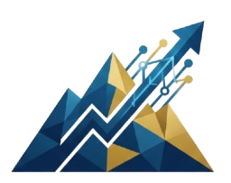

<div align="center">

<br />



<br />
<br />

# Eben Dev Solutions

### *Software that feels as good as it performs.*

<p>
  
  
  
  
  
  
  
</p>

<p>
  
  
  
  
</p>

<br />

> **We design and engineer full-stack platforms, AI-powered products, and interactive interfaces — from first sketch to production.**

<br />

</div>

---

## ✦ What This Is

This is the **studio website** for Eben Dev Solutions — a hand-crafted, single-page experience built entirely from scratch. No templates. No boilerplate UI kits. Every pixel, animation, and interaction was considered and built deliberately.

The site is structured as a **4-stage narrative scroll** — guiding visitors through the studio's work, its founder, services, and a direct line of contact — all narrated by **Ebbi**, an animated AI companion character that reacts to what you hover, where you scroll, and how long you've been idle.

---

## ✦ Featured Work

<table>
<tr>
<td width="33%" align="center">

### 🔷 Nexus
**Real-time Analytics Console**

Sub-second anomaly detection across a 10M+ events/day pipeline. Canvas chart scrolls at 60 fps even under peak load.

`React` `WebSockets` `Python` `ClickHouse`

**2025 · 10M+ events/day**

</td>
<td width="33%" align="center">

### 🔶 Aura
**3D Product Configurator**

Photoreal WebGL configurator with live material & lighting controls — running on mid-range phones in under 2 seconds.

`Three.js` `WebGL` `Motion` `Next.js`

**2024 · +140% conversion lift**

</td>
<td width="33%" align="center">

### 🔷 Kinetix
**Logistics Infrastructure**

Distributed routing across 24 regions with automated failover. Has never once triggered a 3 AM alert.

`Go` `Node.js` `Kubernetes` `gRPC`

**2024 · 99.99% uptime**

</td>
</tr>
</table>

---

## ✦ Tech Stack

```
Frontend
├── React 19              — UI layer with concurrent features
├── TypeScript 5.8        — end-to-end type safety
├── Tailwind CSS 4        — utility-first styling
├── Motion (Framer) 12    — spring physics & layout animations
├── Lucide React          — icon system
└── Vite 6               — build tooling & dev server

Visual Layer
├── Canvas API            — custom particle backdrop & connector threads
├── WebGL / Shaders       — orbit field & 3D depth effects
└── CSS custom properties — curated indigo × gold design system

AI & Backend
├── Google Gemini API     — AI companion (Ebbi) responses
├── Express.js            — lightweight API server
└── dotenv                — environment configuration

Developer Experience
├── Playwright            — end-to-end testing
├── esbuild               — fast bundling
└── tsx                   — TypeScript execution
```

---

## ✦ Architecture

The app is built around a **Studio context** (`StudioProvider`) that holds global state across the entire experience:

| Concern | Details |
|---|---|
| **Stage navigation** | 4 named stages (`home → work → founder → contact`) driven by scroll and nav clicks |
| **Companion bus** | Priority queue for Ebbi's speech lines, with TTL and idle nudges |
| **Theme system** | Light/dark toggle, persisted to `localStorage`, resolved before first paint |
| **Sound FX** | Toggleable UI chimes and hover audio |
| **Viewport** | Mobile/desktop breakpoint reactivity |
| **Pointer tracking** | Used for connector threads that follow Ebbi's hand |

---

## ✦ Services

| Service | Description |
|---|---|
| 🧱 **Full-stack platforms** | React + Node systems built to stay fast under load. Typed API, sensible caching, responsive front end. |
| ✨ **AI product engineering** | LLM features that survive contact with real users — retrieval, agents, streaming UX, evaluation, and cost controls built in from the start. |
| 🌀 **Interactive interfaces** | Canvas, WebGL, and physics-based motion applied where it *clarifies* a product — configurators, data stories, interfaces worth exploring. |
| 📱 **Cross-platform mobile** | Flutter and React Native apps with offline sync, push, and gesture work that holds 60 fps on mid-range hardware. Tested on the cheap phones, not just the flagship. |

---

## ✦ Design System

The palette was sampled directly from **Ebbi**, the studio mascot — indigo denim outfit, gold sneakers, warm copper hair. Every accent in the UI traces back to her.

```css
/* Core palette */
--ink-950: #04091a;   /* Deepest background   */
--ink-800: #0b2545;   /* Primary foreground   */
--gold-500: #c59b27;  /* Accent               */
--gold-200: #f7e7bd;  /* Warm highlight       */
--copper-400: #d99366;/* Tertiary warmth      */
--paper-050: #fbf9f6; /* Light background     */
```

Typography is set in **Inter** for body, **Inter Tight** for display headings, and **JetBrains Mono** for code — all loaded from Google Fonts with `preconnect` for zero FOIT.

---

## ✦ Getting Started

### Prerequisites

- **Node.js** `18+`
- **npm**

### Installation

```bash
# Clone the repo
git clone https://github.com/HundefraN/Eben-Dev.git
cd Eben-Dev

# Install dependencies
npm install

# Set up environment variables
cp .env.example .env
# → Add your GEMINI_API_KEY to .env
```

### Development

```bash
npm run dev
# → http://localhost:3000
```

### Build

```bash
npm run build
npm run preview
```

### Lint / Type-check

```bash
npm run lint
```

---

## ✦ Environment Variables

Copy `.env.example` to `.env` and fill in:

| Variable | Required | Description |
|---|---|---|
| `GEMINI_API_KEY` | ✅ | Google Gemini API key for the AI companion (Ebbi) |

---

## ✦ Project Structure

```
eben-dev/
├── src/
│   ├── assets/images/          # Logo, mascot images, CEO photo
│   ├── components/             # All UI components
│   │   ├── Backdrop.tsx        # Animated canvas particle background
│   │   ├── Companion.tsx       # Ebbi — the animated AI mascot
│   │   ├── CompanionBubble.tsx # Ebbi's speech bubble
│   │   ├── ConnectorLayer.tsx  # Threads that follow Ebbi's hand
│   │   ├── ContactPanel.tsx    # Stage 3: Contact form
│   │   ├── FounderPanel.tsx    # Stage 2: Founder bio & discipline bars
│   │   ├── HeaderNav.tsx       # Fixed top nav (desktop + mobile sheet)
│   │   ├── Hero.tsx            # Stage 0: Hero copy & live stats
│   │   ├── OrbitField.tsx      # WebGL orbit rings
│   │   ├── ServicesSheet.tsx   # Services slide-in drawer
│   │   ├── StageRail.tsx       # Side navigation rail
│   │   └── WorkPanel.tsx       # Stage 1: Project highlights
│   ├── core/
│   │   ├── studio.tsx          # Global state context + hooks
│   │   └── types.ts            # Shared TypeScript types
│   ├── data/
│   │   └── companyData.ts      # All content — copy, stats, projects, services
│   ├── utils/
│   │   └── audio.ts            # Sound FX utilities
│   ├── App.tsx                 # Root — IntroCurtain + Studio layout
│   ├── main.tsx                # Entry point
│   └── index.css               # Design system tokens + global styles
├── index.html                  # Shell + font preloads + theme init script
├── vite.config.ts
├── tsconfig.json
└── package.json
```

---

## ✦ Founder

<table>
<tr>
<td width="100">

</td>
<td>

**Hundefra Nassir** — Founder & Principal Engineer

Seven years building software that has to hold up in production. Working end to end — architecture, interface, and the unglamorous performance work in between — and staying on a project until it ships.

📍 Addis Ababa · working globally &nbsp;·&nbsp;
📧 hundefra@gmail.com &nbsp;·&nbsp;
📱 +251 925 526 298 &nbsp;·&nbsp;
✈️ [@Hundefra](https://t.me/Hundefra)

</td>
</tr>
</table>

---

## ✦ Stats at a Glance

| 60+ | 7 yrs | 4.5× | 99.99% |
|:---:|:---:|:---:|:---:|
| Products shipped | In production | Median speed-up | Uptime |

---

## ✦ Capabilities

| | |
|---|---|
| ⚡ **Performance** | Sub-second loads, 60 fps interaction, measured on real devices |
| 🤖 **Applied AI** | Retrieval, agents, and streaming UX wired into real products |
| 🌀 **Motion & 3D** | Canvas, WebGL, and spring physics used with restraint |
| ☁️ **Cloud & Scale** | Containerised services, autoscaling, and boring reliable deploys |
| 🛡️ **Security** | Threat modelling, least privilege, and audited dependencies |

---

## ✦ Accessibility & SEO

- Semantic HTML5 landmarks throughout (`header`, `main`, `nav`, `dialog`)
- `aria-live` region announces stage changes to screen readers
- `aria-current="page"` on active nav items
- `aria-modal` on mobile drawer dialog
- Safe-area inset support for notched phones (`env(safe-area-inset-top)`)
- Meta description, Open Graph tags, and `theme-color` per color scheme
- Flash-of-wrong-theme prevention via inline script before first paint

---

<div align="center">

<br />

*Everything moving on this page runs on one animation frame.*

<br />

**Eben Dev Solutions** — Built from scratch. No template.

<br />


</div>
